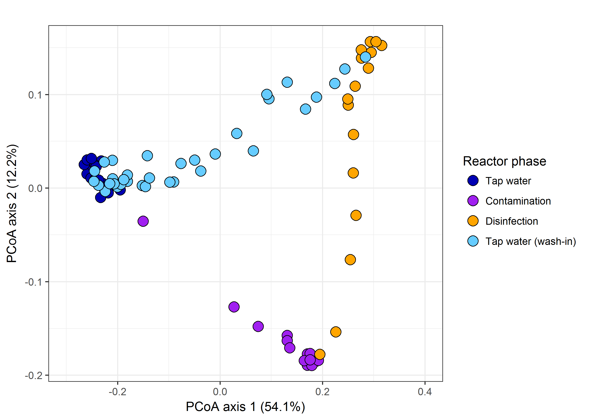
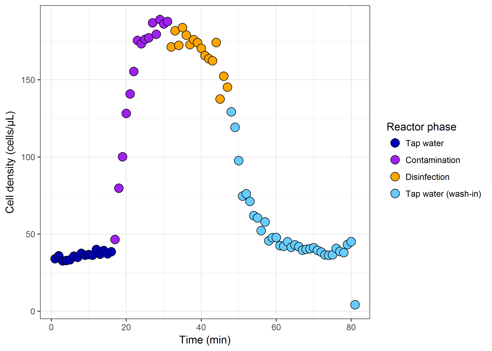

# Analysis for real-time tracking of a microbial contamination event and subsequent shock-chlorination in drinking water
Ruben Props  
`r format(Sys.time(), '%d %B, %Y')`  


```r
# path
path <- "FlowRepository_FR-FCM-ZY2V_files/"

# Import .fcs data
flowData <- read.flowSet(path = path, transformation = FALSE, pattern = ".fcs")
flowData <- flowData[fsApply(x = flowData, FUN = function(x) nrow(x), use.exprs = TRUE)!= 0]

# Create gates for counting cells
sqrcut1 <- matrix(c(8.5,8.5,15,15,3,7.5,14,3)/16.53942,ncol=2, nrow=4)
colnames(sqrcut1) <- c("FL1-H","FL3-H")
polyGate1 <- polygonGate(.gate=sqrcut1, filterId = "Total Cells")
param <- c("FL1-H", "FL3-H", "SSC-H", "FSC-H")

# Order the samples according to the timepoint
# this will make plotting easier
names.order <- c()
for(i in 1: nrow(flowData@phenoData)){
    names.order[i] <- as.numeric(strsplit(rownames(flowData@phenoData[i]),"_")[[1]][1])
}
flowData <- flowData[order(names.order)]

# Extract volume for calculating cell densities
vol.temp <- c()
for(i in 1:length(flowData)){
    vol.temp[i] <- as.numeric(flowData[[i]]@description$`$VOL`)/1000
    }

# Extract the cell counts
s <- flowCore::filter(flowData, polyGate1)
TotalCount <- summary(s); TotalCount <- toTable(TotalCount)
```

```
## filter summary for frame '81_60_Run_chlori_SG.fcs'
##  Total Cells+: 452 of 466 events (97.00%)
## 
## filter summary for frame '81_60_Run_chlori_SGPI.fcs'
##  Total Cells+: 391 of 438 events (89.27%)
## 
## filter summary for frame '82_60_Run_chlori_SG.fcs'
##  Total Cells+: 477 of 491 events (97.15%)
## 
## filter summary for frame '82_60_Run_chlori_SGPI.fcs'
##  Total Cells+: 350 of 396 events (88.38%)
## 
## filter summary for frame '83_60_Run_chlori_SG.fcs'
##  Total Cells+: 433 of 444 events (97.52%)
## 
## filter summary for frame '83_60_Run_chlori_SGPI.fcs'
##  Total Cells+: 373 of 421 events (88.60%)
## 
## filter summary for frame '84_60_Run_chlori_SG.fcs'
##  Total Cells+: 437 of 450 events (97.11%)
## 
## filter summary for frame '84_60_Run_chlori_SGPI.fcs'
##  Total Cells+: 381 of 420 events (90.71%)
## 
## filter summary for frame '85_60_Run_chlori_SG.fcs'
##  Total Cells+: 443 of 455 events (97.36%)
## 
## filter summary for frame '85_60_Run_chlori_SGPI.fcs'
##  Total Cells+: 361 of 408 events (88.48%)
## 
## filter summary for frame '86_60_Run_chlori_SG.fcs'
##  Total Cells+: 474 of 482 events (98.34%)
## 
## filter summary for frame '86_60_Run_chlori_SGPI.fcs'
##  Total Cells+: 375 of 431 events (87.01%)
## 
## filter summary for frame '87_60_Run_chlori_SG.fcs'
##  Total Cells+: 463 of 472 events (98.09%)
## 
## filter summary for frame '87_60_Run_chlori_SGPI.fcs'
##  Total Cells+: 364 of 405 events (89.88%)
## 
## filter summary for frame '88_60_Run_chlori_SG.fcs'
##  Total Cells+: 498 of 516 events (96.51%)
## 
## filter summary for frame '88_60_Run_chlori_SGPI.fcs'
##  Total Cells+: 314 of 354 events (88.70%)
## 
## filter summary for frame '89_60_Run_chlori_SG.fcs'
##  Total Cells+: 482 of 494 events (97.57%)
## 
## filter summary for frame '89_60_Run_chlori_SGPI.fcs'
##  Total Cells+: 380 of 425 events (89.41%)
## 
## filter summary for frame '90_60_Run_chlori_SG.fcs'
##  Total Cells+: 488 of 498 events (97.99%)
## 
## filter summary for frame '90_60_Run_chlori_SGPI.fcs'
##  Total Cells+: 377 of 422 events (89.34%)
## 
## filter summary for frame '91_60_Run_chlori_SG.fcs'
##  Total Cells+: 482 of 501 events (96.21%)
## 
## filter summary for frame '91_60_Run_chlori_SGPI.fcs'
##  Total Cells+: 343 of 398 events (86.18%)
## 
## filter summary for frame '92_60_Run_chlori_SG.fcs'
##  Total Cells+: 531 of 555 events (95.68%)
## 
## filter summary for frame '92_60_Run_chlori_SGPI.fcs'
##  Total Cells+: 382 of 436 events (87.61%)
## 
## filter summary for frame '93_60_Run_chlori_SG.fcs'
##  Total Cells+: 490 of 500 events (98.00%)
## 
## filter summary for frame '93_60_Run_chlori_SGPI.fcs'
##  Total Cells+: 375 of 494 events (75.91%)
## 
## filter summary for frame '94_60_Run_chlori_SG.fcs'
##  Total Cells+: 522 of 538 events (97.03%)
## 
## filter summary for frame '94_60_Run_chlori_SGPI.fcs'
##  Total Cells+: 392 of 437 events (89.70%)
## 
## filter summary for frame '95_60_Run_chlori_SG.fcs'
##  Total Cells+: 493 of 504 events (97.82%)
## 
## filter summary for frame '95_60_Run_chlori_SGPI.fcs'
##  Total Cells+: 333 of 371 events (89.76%)
## 
## filter summary for frame '96_60_Run_chlori_SG.fcs'
##  Total Cells+: 511 of 531 events (96.23%)
## 
## filter summary for frame '96_60_Run_chlori_SGPI.fcs'
##  Total Cells+: 377 of 430 events (87.67%)
## 
## filter summary for frame '97_60_Run_chlori_SG.fcs'
##  Total Cells+: 617 of 630 events (97.94%)
## 
## filter summary for frame '97_60_Run_chlori_SGPI.fcs'
##  Total Cells+: 452 of 531 events (85.12%)
## 
## filter summary for frame '98_60_Run_chlori_SG.fcs'
##  Total Cells+: 1058 of 1082 events (97.78%)
## 
## filter summary for frame '98_60_Run_chlori_SGPI.fcs'
##  Total Cells+: 610 of 790 events (77.22%)
## 
## filter summary for frame '99_60_Run_chlori_SG.fcs'
##  Total Cells+: 1328 of 1355 events (98.01%)
## 
## filter summary for frame '99_60_Run_chlori_SGPI.fcs'
##  Total Cells+: 830 of 1058 events (78.45%)
## 
## filter summary for frame '100_60_Run_chlori_SG.fcs'
##  Total Cells+: 1701 of 1716 events (99.13%)
## 
## filter summary for frame '100_60_Run_chlori_SGPI.fcs'
##  Total Cells+: 1021 of 1356 events (75.29%)
## 
## filter summary for frame '101_60_Run_chlori_SG.fcs'
##  Total Cells+: 1868 of 1894 events (98.63%)
## 
## filter summary for frame '101_60_Run_chlori_SGPI.fcs'
##  Total Cells+: 1125 of 1490 events (75.50%)
## 
## filter summary for frame '102_60_Run_chlori_SG.fcs'
##  Total Cells+: 2061 of 2084 events (98.90%)
## 
## filter summary for frame '102_60_Run_chlori_SGPI.fcs'
##  Total Cells+: 1272 of 1692 events (75.18%)
## 
## filter summary for frame '103_60_Run_chlori_SG.fcs'
##  Total Cells+: 2329 of 2346 events (99.28%)
## 
## filter summary for frame '103_60_Run_chlori_SGPI.fcs'
##  Total Cells+: 1224 of 1672 events (73.21%)
## 
## filter summary for frame '104_60_Run_chlori_SG.fcs'
##  Total Cells+: 2300 of 2322 events (99.05%)
## 
## filter summary for frame '104_60_Run_chlori_SGPI.fcs'
##  Total Cells+: 1379 of 1833 events (75.23%)
## 
## filter summary for frame '105_60_Run_chlori_SG.fcs'
##  Total Cells+: 2337 of 2360 events (99.03%)
## 
## filter summary for frame '105_60_Run_chlori_SGPI.fcs'
##  Total Cells+: 1300 of 1794 events (72.46%)
## 
## filter summary for frame '106_60_Run_chlori_SG.fcs'
##  Total Cells+: 2351 of 2371 events (99.16%)
## 
## filter summary for frame '106_60_Run_chlori_SGPI.fcs'
##  Total Cells+: 1314 of 1763 events (74.53%)
## 
## filter summary for frame '107_60_Run_chlori_SG.fcs'
##  Total Cells+: 2480 of 2504 events (99.04%)
## 
## filter summary for frame '107_60_Run_chlori_SGPI.fcs'
##  Total Cells+: 1358 of 1820 events (74.62%)
## 
## filter summary for frame '108_60_Run_chlori_SG.fcs'
##  Total Cells+: 2382 of 2402 events (99.17%)
## 
## filter summary for frame '108_60_Run_chlori_SGPI.fcs'
##  Total Cells+: 1256 of 1713 events (73.32%)
## 
## filter summary for frame '109_60_Run_chlori_SG.fcs'
##  Total Cells+: 2508 of 2535 events (98.93%)
## 
## filter summary for frame '109_60_Run_chlori_SGPI.fcs'
##  Total Cells+: 1367 of 1819 events (75.15%)
## 
## filter summary for frame '110_60_Run_chlori_SG.fcs'
##  Total Cells+: 2471 of 2486 events (99.40%)
## 
## filter summary for frame '110_60_Run_chlori_SGPI.fcs'
##  Total Cells+: 1323 of 1787 events (74.03%)
## 
## filter summary for frame '111_60_Run_chlori_SG.fcs'
##  Total Cells+: 2491 of 2511 events (99.20%)
## 
## filter summary for frame '111_60_Run_chlori_SGPI.fcs'
##  Total Cells+: 1384 of 1870 events (74.01%)
## 
## filter summary for frame '112_60_Run_chlori_SG.fcs'
##  Total Cells+: 2273 of 2290 events (99.26%)
## 
## filter summary for frame '112_60_Run_chlori_SGPI.fcs'
##  Total Cells+: 1103 of 1662 events (66.37%)
## 
## filter summary for frame '113_60_Run_chlori_SG.fcs'
##  Total Cells+: 2411 of 2435 events (99.01%)
## 
## filter summary for frame '113_60_Run_chlori_SGPI.fcs'
##  Total Cells+: 494 of 1538 events (32.12%)
## 
## filter summary for frame '114_60_Run_chlori_SG.fcs'
##  Total Cells+: 2287 of 2303 events (99.31%)
## 
## filter summary for frame '114_60_Run_chlori_SGPI.fcs'
##  Total Cells+: 142 of 1454 events (9.77%)
## 
## filter summary for frame '115_60_Run_chlori_SG.fcs'
##  Total Cells+: 2439 of 2467 events (98.87%)
## 
## filter summary for frame '115_60_Run_chlori_SGPI.fcs'
##  Total Cells+: 106 of 1521 events (6.97%)
## 
## filter summary for frame '116_60_Run_chlori_SG.fcs'
##  Total Cells+: 2374 of 2403 events (98.79%)
## 
## filter summary for frame '116_60_Run_chlori_SGPI.fcs'
##  Total Cells+: 67 of 1435 events (4.67%)
## 
## filter summary for frame '117_60_Run_chlori_SG.fcs'
##  Total Cells+: 2293 of 2334 events (98.24%)
## 
## filter summary for frame '117_60_Run_chlori_SGPI.fcs'
##  Total Cells+: 62 of 1520 events (4.08%)
## 
## filter summary for frame '118_60_Run_chlori_SG.fcs'
##  Total Cells+: 2334 of 2365 events (98.69%)
## 
## filter summary for frame '118_60_Run_chlori_SGPI.fcs'
##  Total Cells+: 59 of 1423 events (4.15%)
## 
## filter summary for frame '119_60_Run_chlori_SG.fcs'
##  Total Cells+: 2309 of 2349 events (98.30%)
## 
## filter summary for frame '119_60_Run_chlori_SGPI.fcs'
##  Total Cells+: 71 of 1366 events (5.20%)
## 
## filter summary for frame '120_60_Run_chlori_SG.fcs'
##  Total Cells+: 2261 of 2299 events (98.35%)
## 
## filter summary for frame '120_60_Run_chlori_SGPI.fcs'
##  Total Cells+: 80 of 1286 events (6.22%)
## 
## filter summary for frame '121_60_Run_chlori_SG.fcs'
##  Total Cells+: 2199 of 2229 events (98.65%)
## 
## filter summary for frame '121_60_Run_chlori_SGPI.fcs'
##  Total Cells+: 73 of 1207 events (6.05%)
## 
## filter summary for frame '122_60_Run_chlori_SG.fcs'
##  Total Cells+: 2172 of 2219 events (97.88%)
## 
## filter summary for frame '122_60_Run_chlori_SGPI.fcs'
##  Total Cells+: 80 of 873 events (9.16%)
## 
## filter summary for frame '123_60_Run_chlori_SG.fcs'
##  Total Cells+: 2153 of 2190 events (98.31%)
## 
## filter summary for frame '123_60_Run_chlori_SGPI.fcs'
##  Total Cells+: 60 of 463 events (12.96%)
## 
## filter summary for frame '124_60_Run_chlori_SG.fcs'
##  Total Cells+: 2310 of 2364 events (97.72%)
## 
## filter summary for frame '124_60_Run_chlori_SGPI.fcs'
##  Total Cells+: 92 of 167 events (55.09%)
## 
## filter summary for frame '125_60_Run_chlori_SG.fcs'
##  Total Cells+: 1824 of 1863 events (97.91%)
## 
## filter summary for frame '125_60_Run_chlori_SGPI.fcs'
##  Total Cells+: 79 of 150 events (52.67%)
## 
## filter summary for frame '126_60_Run_chlori_SG.fcs'
##  Total Cells+: 2021 of 2080 events (97.16%)
## 
## filter summary for frame '126_60_Run_chlori_SGPI.fcs'
##  Total Cells+: 70 of 125 events (56.00%)
## 
## filter summary for frame '127_60_Run_chlori_SG.fcs'
##  Total Cells+: 1928 of 1990 events (96.88%)
## 
## filter summary for frame '127_60_Run_chlori_SGPI.fcs'
##  Total Cells+: 62 of 126 events (49.21%)
## 
## filter summary for frame '128_60_Run_chlori_SG.fcs'
##  Total Cells+: 1714 of 1767 events (97.00%)
## 
## filter summary for frame '128_60_Run_chlori_SGPI.fcs'
##  Total Cells+: 58 of 123 events (47.15%)
## 
## filter summary for frame '129_60_Run_chlori_SG.fcs'
##  Total Cells+: 1582 of 1620 events (97.65%)
## 
## filter summary for frame '129_60_Run_chlori_SGPI.fcs'
##  Total Cells+: 62 of 146 events (42.47%)
## 
## filter summary for frame '130_60_Run_chlori_SG.fcs'
##  Total Cells+: 1295 of 1327 events (97.59%)
## 
## filter summary for frame '130_60_Run_chlori_SGPI.fcs'
##  Total Cells+: 71 of 168 events (42.26%)
## 
## filter summary for frame '131_60_Run_chlori_SG.fcs'
##  Total Cells+: 990 of 1016 events (97.44%)
## 
## filter summary for frame '131_60_Run_chlori_SGPI.fcs'
##  Total Cells+: 52 of 181 events (28.73%)
## 
## filter summary for frame '132_60_Run_chlori_SG.fcs'
##  Total Cells+: 1010 of 1045 events (96.65%)
## 
## filter summary for frame '132_60_Run_chlori_SGPI.fcs'
##  Total Cells+: 60 of 240 events (25.00%)
## 
## filter summary for frame '133_60_Run_chlori_SG.fcs'
##  Total Cells+: 945 of 973 events (97.12%)
## 
## filter summary for frame '133_60_Run_chlori_SGPI.fcs'
##  Total Cells+: 83 of 285 events (29.12%)
## 
## filter summary for frame '134_60_Run_chlori_SG.fcs'
##  Total Cells+: 823 of 844 events (97.51%)
## 
## filter summary for frame '134_60_Run_chlori_SGPI.fcs'
##  Total Cells+: 83 of 293 events (28.33%)
## 
## filter summary for frame '135_60_Run_chlori_SG.fcs'
##  Total Cells+: 803 of 830 events (96.75%)
## 
## filter summary for frame '135_60_Run_chlori_SGPI.fcs'
##  Total Cells+: 91 of 341 events (26.69%)
## 
## filter summary for frame '136_60_Run_chlori_SG.fcs'
##  Total Cells+: 693 of 707 events (98.02%)
## 
## filter summary for frame '136_60_Run_chlori_SGPI.fcs'
##  Total Cells+: 66 of 297 events (22.22%)
## 
## filter summary for frame '137_60_Run_chlori_SG.fcs'
##  Total Cells+: 768 of 787 events (97.59%)
## 
## filter summary for frame '137_60_Run_chlori_SGPI.fcs'
##  Total Cells+: 83 of 280 events (29.64%)
## 
## filter summary for frame '138_60_Run_chlori_SG.fcs'
##  Total Cells+: 606 of 617 events (98.22%)
## 
## filter summary for frame '138_60_Run_chlori_SGPI.fcs'
##  Total Cells+: 87 of 302 events (28.81%)
## 
## filter summary for frame '139_60_Run_chlori_SG.fcs'
##  Total Cells+: 633 of 647 events (97.84%)
## 
## filter summary for frame '139_60_Run_chlori_SGPI.fcs'
##  Total Cells+: 103 of 324 events (31.79%)
## 
## filter summary for frame '140_60_Run_chlori_SG.fcs'
##  Total Cells+: 634 of 647 events (97.99%)
## 
## filter summary for frame '140_60_Run_chlori_SGPI.fcs'
##  Total Cells+: 110 of 305 events (36.07%)
## 
## filter summary for frame '141_60_Run_chlori_SG.fcs'
##  Total Cells+: 565 of 576 events (98.09%)
## 
## filter summary for frame '141_60_Run_chlori_SGPI.fcs'
##  Total Cells+: 119 of 340 events (35.00%)
## 
## filter summary for frame '142_60_Run_chlori_SG.fcs'
##  Total Cells+: 558 of 572 events (97.55%)
## 
## filter summary for frame '142_60_Run_chlori_SGPI.fcs'
##  Total Cells+: 127 of 302 events (42.05%)
## 
## filter summary for frame '143_60_Run_chlori_SG.fcs'
##  Total Cells+: 597 of 612 events (97.55%)
## 
## filter summary for frame '143_60_Run_chlori_SGPI.fcs'
##  Total Cells+: 138 of 294 events (46.94%)
## 
## filter summary for frame '144_60_Run_chlori_SG.fcs'
##  Total Cells+: 549 of 559 events (98.21%)
## 
## filter summary for frame '144_60_Run_chlori_SGPI.fcs'
##  Total Cells+: 184 of 351 events (52.42%)
## 
## filter summary for frame '145_60_Run_chlori_SG.fcs'
##  Total Cells+: 571 of 580 events (98.45%)
## 
## filter summary for frame '145_60_Run_chlori_SGPI.fcs'
##  Total Cells+: 187 of 340 events (55.00%)
## 
## filter summary for frame '146_60_Run_chlori_SG.fcs'
##  Total Cells+: 556 of 575 events (96.70%)
## 
## filter summary for frame '146_60_Run_chlori_SGPI.fcs'
##  Total Cells+: 231 of 358 events (64.53%)
## 
## filter summary for frame '147_60_Run_chlori_SG.fcs'
##  Total Cells+: 526 of 538 events (97.77%)
## 
## filter summary for frame '147_60_Run_chlori_SGPI.fcs'
##  Total Cells+: 230 of 350 events (65.71%)
## 
## filter summary for frame '148_60_Run_chlori_SG.fcs'
##  Total Cells+: 533 of 549 events (97.09%)
## 
## filter summary for frame '148_60_Run_chlori_SGPI.fcs'
##  Total Cells+: 234 of 334 events (70.06%)
## 
## filter summary for frame '149_60_Run_chlori_SG.fcs'
##  Total Cells+: 537 of 555 events (96.76%)
## 
## filter summary for frame '149_60_Run_chlori_SGPI.fcs'
##  Total Cells+: 257 of 366 events (70.22%)
## 
## filter summary for frame '150_60_Run_chlori_SG.fcs'
##  Total Cells+: 547 of 561 events (97.50%)
## 
## filter summary for frame '150_60_Run_chlori_SGPI.fcs'
##  Total Cells+: 287 of 393 events (73.03%)
## 
## filter summary for frame '151_60_Run_chlori_SG.fcs'
##  Total Cells+: 524 of 546 events (95.97%)
## 
## filter summary for frame '151_60_Run_chlori_SGPI.fcs'
##  Total Cells+: 298 of 421 events (70.78%)
## 
## filter summary for frame '152_60_Run_chlori_SG.fcs'
##  Total Cells+: 509 of 520 events (97.88%)
## 
## filter summary for frame '152_60_Run_chlori_SGPI.fcs'
##  Total Cells+: 307 of 372 events (82.53%)
## 
## filter summary for frame '153_60_Run_chlori_SG.fcs'
##  Total Cells+: 484 of 499 events (96.99%)
## 
## filter summary for frame '153_60_Run_chlori_SGPI.fcs'
##  Total Cells+: 331 of 420 events (78.81%)
## 
## filter summary for frame '154_60_Run_chlori_SG.fcs'
##  Total Cells+: 482 of 498 events (96.79%)
## 
## filter summary for frame '154_60_Run_chlori_SGPI.fcs'
##  Total Cells+: 268 of 327 events (81.96%)
## 
## filter summary for frame '155_60_Run_chlori_SG.fcs'
##  Total Cells+: 486 of 497 events (97.79%)
## 
## filter summary for frame '155_60_Run_chlori_SGPI.fcs'
##  Total Cells+: 304 of 358 events (84.92%)
## 
## filter summary for frame '156_60_Run_chlori_SG.fcs'
##  Total Cells+: 541 of 562 events (96.26%)
## 
## filter summary for frame '156_60_Run_chlori_SGPI.fcs'
##  Total Cells+: 306 of 348 events (87.93%)
## 
## filter summary for frame '157_60_Run_chlori_SG.fcs'
##  Total Cells+: 515 of 524 events (98.28%)
## 
## filter summary for frame '157_60_Run_chlori_SGPI.fcs'
##  Total Cells+: 307 of 368 events (83.42%)
## 
## filter summary for frame '158_60_Run_chlori_SG.fcs'
##  Total Cells+: 504 of 526 events (95.82%)
## 
## filter summary for frame '158_60_Run_chlori_SGPI.fcs'
##  Total Cells+: 373 of 483 events (77.23%)
## 
## filter summary for frame '159_60_Run_chlori_SG.fcs'
##  Total Cells+: 574 of 588 events (97.62%)
## 
## filter summary for frame '159_60_Run_chlori_SGPI.fcs'
##  Total Cells+: 314 of 366 events (85.79%)
## 
## filter summary for frame '160_60_Run_chlori_SG.fcs'
##  Total Cells+: 598 of 621 events (96.30%)
## 
## filter summary for frame '160_60_Run_chlori_SGPI.fcs'
##  Total Cells+: 352 of 393 events (89.57%)
## 
## filter summary for frame '161_60_Run_chlori_SG.fcs'
##  Total Cells+: 56 of 59 events (94.92%)
## 
## filter summary for frame '161_60_Run_chlori_SGPI.fcs'
##  Total Cells+: 56 of 61 events (91.80%)
```

```r
# Store counts in dataframe
count_results <- data.frame(Counts = TotalCount$true, volume = vol.temp)
rownames(count_results) <- flowCore::sampleNames(flowData)

# Extract staining label from sample names
lab.chlor<-c()
for(i in 1:nrow(count_results)) lab.chlor[i] <- strsplit(strsplit(rownames(count_results)[i],"_")[[1]][5],".fcs")[[1]][1]
count_results$stain <- as.factor(lab.chlor)
```


```r
# Calculate fingerprint for beta-diversity analysis
fbasis <- flowBasis(flowData[count_results$stain == "SG"], param, nbin = 128, bw = 0.01, normalize = function(x) x)

# Perform PCoA
pcoa <- beta_div_fcm(fbasis, ord.type="pcoa")

### Add labels for chlorination
chlor.time <- c(); chlor.time[1:81] <- "Tap water"
chlor.time[17:31] <- "Contamination"
chlor.time[32:47] <- "Disinfection"
chlor.time[48:81] <- "Tap water (wash-in)"
chlor.time <- factor(chlor.time,levels = c("Tap water", "Contamination", "Disinfection","Tap water (wash-in)"))

### Plot beta-diversity analysis
p_beta <- plot_beta_fcm(pcoa, color = chlor.time, labels = c("Reactor phase"))+ ggtitle("") + 
  geom_point(shape = 21, size = 4, aes(fill = chlor.time))+
  labs(fill="Reactor phase",x=paste("PCoA axis 1 (",round(100*pcoa$eig/sum(pcoa$eig),1)[1],"%)", sep=""),y=paste("PCoA axis 2 (",round(100*pcoa$eig/sum(pcoa$eig),1)[2],"%)", sep=""))+
  scale_fill_manual(values = c("#0000b3", "#A020F0FF", "#FFA500FF","#66ccff"))+ 
  scale_color_manual(values = rep("black", 4))+
  theme_bw()+
  xlim(-0.3,0.4)
```

```
## Scale for 'colour' is already present. Adding another scale for
## 'colour', which will replace the existing scale.
```

```r
# Print plot
print(p_beta)
```



```r
count_results_SG <- count_results %>% filter(stain == "SG")
count_results_SG$time <- chlor.time
p_counts <- ggplot(data=count_results_SG, aes(x=seq(1:81),
                                              y=Counts/volume,color=time,fill=time)) + 
  scale_fill_manual(values = c("#0000b3", "#A020F0FF", "#FFA500FF","#66ccff"))+
  geom_point(size=4, shape=21, color="black")+labs(x="Time (min)", y="Cell density (cells/µL)",fill="Reactor phase")+ theme_bw()

# Print plot
print(p_counts)
```


